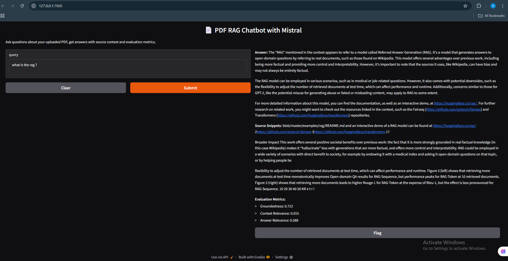

# 📄 PDF RAG Chatbot using Mistral + FAISS + Gradio

An open-source, fully local Retrieval-Augmented Generation (RAG) chatbot that allows you to chat with any PDF using the **Mistral 7B** model for both **embeddings** and **language generation**.

This project runs locally in Google Colab (or any Python environment), using:
- 🧠 `llama-cpp-python` to run Mistral 7B in GGUF format
- ⚡ `FAISS` for vector similarity search
- 🔍 `LangChain` for managing the RAG pipeline
- 🧪 Custom evaluation metrics for each answer
- 🎛️ `Gradio` UI to chat interactively

---

## 🧰 Features

- 📥 Upload and chat with any PDF document
- 🧩 Semantic chunking and indexing with FAISS
- 🤖 Local inference using `llama-cpp` and `Mistral 7B`
- ✅ Evaluation of each response with:
  - Groundedness (is the answer supported by the source?)
  - Context relevance (relation between query and retrieved docs)
  - Answer relevance (semantic match with the question)
- 💬 Chatbot UI using Gradio (local or public link)
- 🔒 Runs fully offline — no API keys or cloud services needed

---

## 🚀 Demo Screenshot

  
*(Upload your own UI screenshot named `screenshot.png` in the repo.)*

---

## 📦 Installation (Colab Recommended)

1. Upload your `mistral-7b-instruct-v0.1.Q4_K_M.gguf` model to Colab or local folder.
2. Clone the repo and run the notebook step-by-step.
3. PDF is uploaded interactively during runtime.

Or use this repo in Google Colab:  
[📔 Open in Colab](https://colab.research.google.com/)

---

## 🛠️ Tech Stack

- `Mistral 7B` (GGUF) via `llama-cpp-python`
- `FAISS` for vector search
- `LangChain` for RAG
- `sentence-transformers` for evaluation
- `Gradio` for UI
- `pypdf`, `nltk`, `rouge-score` for preprocessing & evaluation

---

## 📈 Evaluation Metrics Explained

| Metric            | Description                                                                 |
|-------------------|-----------------------------------------------------------------------------|
| Groundedness      | Measures if the answer is supported by the retrieved source documents       |
| Context Relevance | Checks how well the retrieved context relates to the question               |
| Answer Relevance  | Semantic similarity between the question and generated answer               |

---

## 📂 Project Structure

